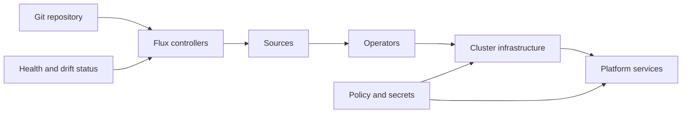

# FluxCD platform manifests

[](https://github.com/Alexandr-Zayats/devops-fluxcd/actions/workflows/ci.yml)
[](https://fluxcd.io/)
[](https://kubernetes.io/)
[](LICENSE)

Composable Kubernetes and FluxCD building blocks for operating a shared platform through GitOps. The catalogue covers sources, operators, cluster infrastructure, observability, security controls, data services and developer-facing services.

## Project profile

Reusable platform catalogue for infrastructure teams standardizing cluster
bootstrap and service delivery. Consume selected bases from an environment
repository; do not apply the entire catalogue blindly.

## Catalogue

| Area | Examples |
|---|---|
| Sources and operators | Flux sources, cert-manager, Strimzi, database operators and AWS controllers |
| Cluster infrastructure | ingress, storage classes, CSI drivers, external DNS, Karpenter and Velero |
| Security | external secrets, secret stores, Kyverno policies and internal certificate issuers |
| Observability | Prometheus, VictoriaMetrics, Datadog and service exporters |
| Data and messaging | PostgreSQL, MySQL, MongoDB, Redis, RabbitMQ, Kafka and ClickHouse |
| Platform services | GitLab Runner, Nexus, SonarQube, Sentry, Kubecost, VPN and shared services |

## Layout

```text
base/common/      Shared resources and defaults
base/sources/     Flux source definitions
base/operators/   Cluster-wide operators
base/infra/       Infrastructure and platform controllers
base/services/    Workloads consumed by engineering teams
```

## Reconciliation model



## Usage

Compose selected bases from an environment repository rather than applying the full catalogue directly:

```yaml
apiVersion: kustomize.config.k8s.io/v1beta1
kind: Kustomization
resources:
  - github.com/Alexandr-Zayats/devops-fluxcd//base/services/external-secrets?ref=<version>
  - github.com/Alexandr-Zayats/devops-fluxcd//base/infra/cert-manager?ref=<version>
```

Before reconciliation:

1. Pin the repository reference to an immutable version.
2. Supply environment-specific domains, registries, namespaces and values through overlays.
3. Store secrets in an external secret manager or encrypted SOPS files.
4. Build the affected Kustomization locally and review the rendered resources.
5. Reconcile in dependency order and verify Flux health.

## Validation

CI parses every YAML document, validates Kustomization file structure and rejects obvious plaintext secret-key fields. Environment repositories should add schema validation and policy tests against their exact Kubernetes version and CRD set.

See [SECURITY.md](SECURITY.md) for vulnerability reporting and [CONTRIBUTING.md](CONTRIBUTING.md) for change requirements. Licensed under the [MIT License](LICENSE).
